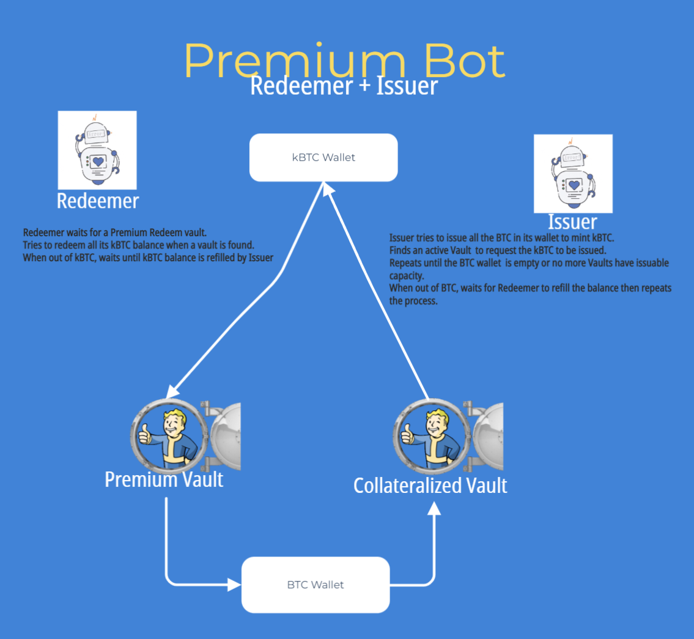

# Premium BOT
## by Kint0Sens

### part of the TRADING/ARBITRAGE BOTS bounty (https://github.com/interlay/bounties/issues/2)

### License
Copyright 2022 Kint@Sens

The Premium BOT repository is a fork of the interlay/interbtc-clients. All the modifications are licensed under the Apache License, Version 2.0. 
See the LICENSE_PREMIUM_BOT file.

### Project Repository

### Video presentation
## Overview
The Premium BOT is composed of two binaries, the Redemer and the Issuer. They are supposed to be run in parallel. The Redeemer consumes KBTC[^1] when premium redeems are possible and generated BTC. The Issuer consumes the BTC and refills the Redeemer KBTC balance.

The Premium BOT is written in Rust as an fork of the interbtc-clients repository of interlay. 

  

### The Redeemer
The purpose of the Redeemer is to monitor vaults for Premium Redeem opportunities and then request premium redeems with as much of its kBTC balance as possible and transfer BTC in the Issuer's BTC Wallet.

The Redeemer will monitor the active vaults until it finds a vault that offers Premium Redeem due to its collateralization level.
Once found it will request a premium redeem of the maximum available amount (limited by the bot's own kBTC balance).
Once the Redeemer has run out of kBTC balance it will sleep until its balance is refilled and then it will resume searching for Premium Redeem Vaults.

  

### The Issuer
Tue purpose of the Issuer is to select a vault with issuable capacity and send issue request to it in order to consume BTC and fill the kBTC account of the Redeemer. The Issuer will repeat this as long as it has BTC Balance and as long as it finds a vault with some kBTC capacity. It will then be idle until its BTC balance is refilled again by the Redeemer.  

  

### Typical Use case
The use case of the Premium BOT is the following:

A user provides an account on the Intrelay para (the BOT Interlay Account) with a certain amount of wrapped token (kBTC, iBTC) and some native token (KINT, INTR) for gas. Ideally the amount allocated 

## Technical details

### How to build

### Hot to run

[^1]: We refer here to a Kintsugi Parachain, but the Premium BOT will work similarly in a Testnet or Interlay network. Just replace the Kintsugi, KBTC, KINT, KSM terms accordingly.